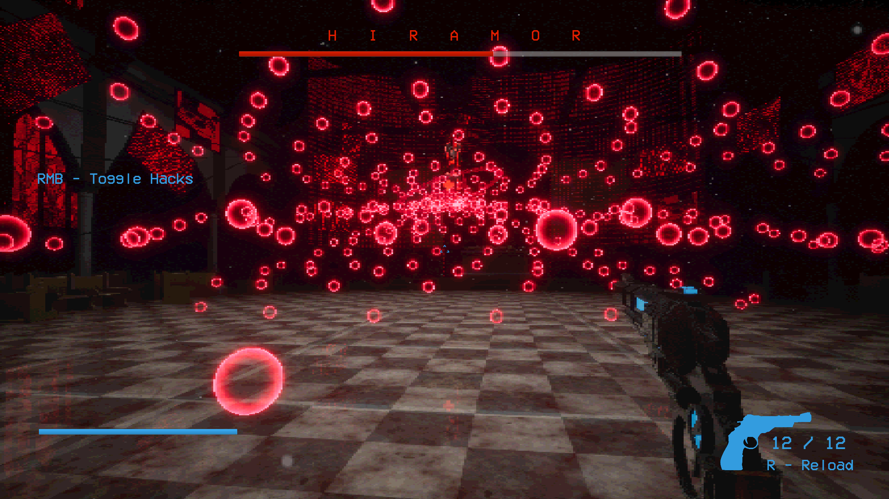

# DEAD//SIGNAL

A boss fight prototype built in Unreal Engine 5.8 during the Boss Fight Game Jam, 7–13 September 2026.

**Play it here:** https://serhiikozlov.itch.io/deadsignal



## The premise

You are Prometheus, a neurologically modified metahuman built as the contingency plan for machines going rogue across Silver City.

The dispatch names Hiramor, a hyper-intelligent machine created by pastor Osepheus. Hiramor watched the pastors who came after Osepheus commit a blasphemous act in the name of Dolores, and it answered by murdering every member of the church.

You have one task. Put him out of his misery.

## Controls

| Input | Action |
|---|---|
| `WASD` | Move |
| `Left Mouse` | Shoot |
| `Right Mouse` | Toggle hack panel |
| `1` `2` `3` `4` | Type hack sequences |
| `R` | Reload |
| `Esc` / `P` | Pause |

## The fight

Hiramor holds a shield that reduces almost all incoming damage. Shooting a shielded boss is not pointless, just slow - the real damage window opens when you hack.

Opening the hack panel stops you shooting. The four hacks drop the shield, stun the boss, raise a shield of your own, or heal. Sequences are regenerated every time the panel opens, so they can't be memorised.

The fight runs in three phases driven by Hiramor's health, each with its own ordered attack sequence:

- **Bullet patterns** - fans of projectiles spread across a yaw arc and stacked into pitch bands
- **Laser sweep** - a beam that locks onto player position, then rotates up from the ground so it has to be dodged
- **Teleport** - repositioning between pre-determined anchor points

## Technical notes

The project is C++ and Blueprints, C++ defines the rules, Blueprints used for the tweaks. Every system exposes `EditAnywhere` data and Blueprint events, so timings, effects and presentation are adjustable in the editor.

**Data-driven attacks.** `FBossAttackStep` describes one attack - type, telegraph, duration, recovery, intensity, plus per-type fields. A phase is an array of them. Adding an attack means editing an array in the editor, not writing code.

**Delegate-driven UI.** Ten widget base classes bind to gameplay delegates and repaint on change instead of polling every frame.

**Object pooling.** Bullet patterns can put hundreds of projectiles in the air, so they come from a `UWorldSubsystem` pool that resets them on acquire rather than spawning and destroying actors.

**A Slate debug panel.** `Debug.Panel` in the console opens a floating OS window - a real top-level window, draggable onto a second monitor - with live readouts and buttons to jump phases, drop the shield, damage either fighter, and reset hack cooldowns. Testing a phase 3 attack took one click instead of a full playthrough, which is most of why the fight got tuned at all inside a week.

### Source layout

```
Source/BossFightJam/
  Public/Core/      shared types, the damage interface, the game mode
  Public/Combat/    boss, weapon, hacks, health, projectiles, pool
  Public/UI/        widget base classes
  Public/Audio/     music director
  Public/Debug/     console commands and the Slate panel
```

`Private/` mirrors it.

## Building

1. Unreal Engine 5.8
2. Right-click `BossFightJam.uproject` → *Generate Visual Studio project files*
3. Build the `BossFightJamEditor` target, then open the `.uproject`

## Work in progress

This is a prototype, and it's getting updates:

- A redesigned arena layout, more detailed and built for better player mobility
- More boss attacks, including an EMP that disables your hacks and your HUD
- Improved game feel based on the feedback from playtesting sessions

## Credits

| | | |
|---|---|---|
| **Serhii Kozlov** | Programming | [LinkedIn](https://www.linkedin.com/in/serhii-kozlov12/) |
| **Pranoy Jith** | Environment, boss art and shaders | [LinkedIn](https://www.linkedin.com/in/pranoy-jith-493364336/) |
| **Davide Motta** | Weapon modelling and animating | [LinkedIn](https://www.linkedin.com/in/davide-motta21/?locale=en) |
| **Ishan Choudhury** | Music and SFX | [LinkedIn](https://www.linkedin.com/in/ishan-choudhury/) |

